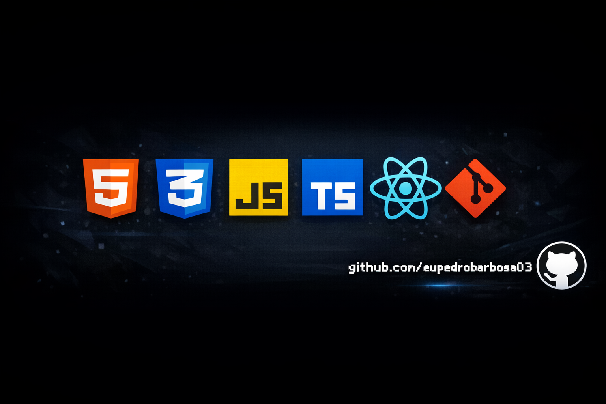

## 👋 Olá, eu sou o Pedro Henrique

💻 Desenvolvedor Front-end em constante evolução;  
🚀 Focado em me tornar um desenvolvedor front-end completo.  

---

## 🧠 Sobre mim

Sou um desenvolvedor apaixonado por tecnologia e evolução constante.  
Atualmente atuo no front-end, criando interfaces simples, modernas, funcionais e bem estruturadas.
Tenho como objetivo expandir meus conhecimentos para o back-end (mais à frente) e me tornar um desenvolvedor full stack completo.

---

## 🚀 Tecnologias que utilizo

  
  
  
  
  
  
  

---

## 📂 Projetos

Já desenvolvi **14 projetos**, com destaque para:

- 💼 **Portfólio** — Apresentação dos meus projetos e habilidades;  
- 🏦 **Bank-TS** — Sistema bancário utilizando TypeScript;  
- 💬 **Chat-BPH** — Aplicação de chat em tempo real;  
- 🔐 **Generator Password 2** — Gerador de senhas seguro e personalizável.  

---

## 📈 Objetivos

- Se tornar um desenevolvedor **full-stack**;
- Se aprimorar cada vez mais em **react** e **typescrip**;
- Criar projetos cada vez mais completos e profissionais;
- Sempre que possível desenvolver uma segunda versão melhorada para projetos.  

---

  <picture>
    <source media="(prefers-color-scheme: dark)" srcset="https://github.com/eupedrobarbosa03/eupedrobarbosa03/blob/output/github-contribution-grid-snake-dark.svg">
    <source media="(prefers-color-scheme: light)" srcset="https://github.com/eupedrobarbosa03/eupedrobarbosa03/blob/output/github-contribution-grid-snake.svg">
    
  </picture>

  
  
  

---

<i>⭐ Sempre buscando evolução e novos desafios.</i>

